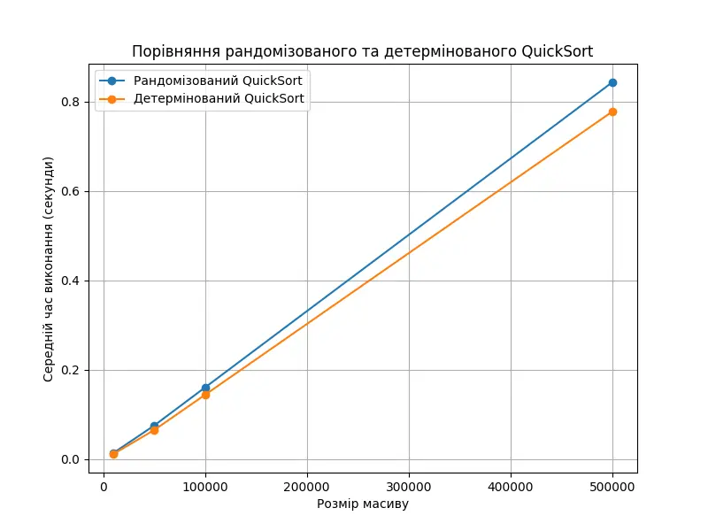

### 1. Порівняння рандомізованого та детермінованого QuickSort

Результат:

```
Розмір масиву: 10000
        Рандомізований QuickSort: 0.0136 секунд
        Детермінований QuickSort: 0.0115 секунд
Розмір масиву: 50000
        Рандомізований QuickSort: 0.0748 секунд
        Детермінований QuickSort: 0.0644 секунд
Розмір масиву: 100000
        Рандомізований QuickSort: 0.1577 секунд
        Детермінований QuickSort: 0.1376 секунд
Розмір масиву: 500000
        Рандомізований QuickSort: 0.8477 секунд
        Детермінований QuickSort: 0.7624 секунд
```



### 2. Складання розкладу занять за допомогою жадібного алгоритму

Результат:

```
Розклад занять:
Наталія Шевченко, 29 років, email: n.shevchenko@example.com
   Викладає предмети: Біологія, Хімія

Дмитро Бондаренко, 35 років, email: d.bondarenko@example.com
   Викладає предмети: Інформатика, Фізика

Олександр Іваненко, 45 років, email: o.ivanenko@example.com
   Викладає предмети: Математика
```
